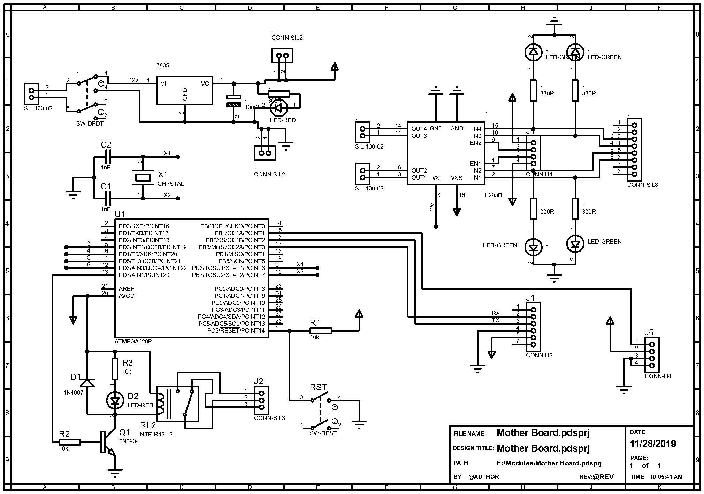

# Output

---
<h1>Green University of Bangladesh </h1>

<h2>Dept. of Computer Science Engineering</h2>

Course Title: Digital Logic Design Lab

Course Code: CSE-204

Project: LPG Gass and Smoke Detection

---

 Project Diagram
---

---

<h1 id="test-title">Project in PDF</h1>

<object data="loremipsum.pdf#page=2" type="application/pdf" width="700px" height="700px">
    <embed src="loremipsum.pdf#page=2">
        
Click here for project report: <a href="DLD-Lab-Project.pdf">Download PDF</a>.

    </embed>
</object>

Project Video
---

    <iframe width="640" height="390" 
    src="https://www.youtube.com/embed/{{ yhmApqii0Po}}" 
    frameborder="0" allowfullscreen></iframe>

<!-- all link is here -->

### Contact me:

[E-mail](tanvirpoly@gmail.com)

[Linkedin]( https://www.linkedin.com/in/tanvirx/)

[Facebook]( https://www.facebook.com/tanvirfbid)

